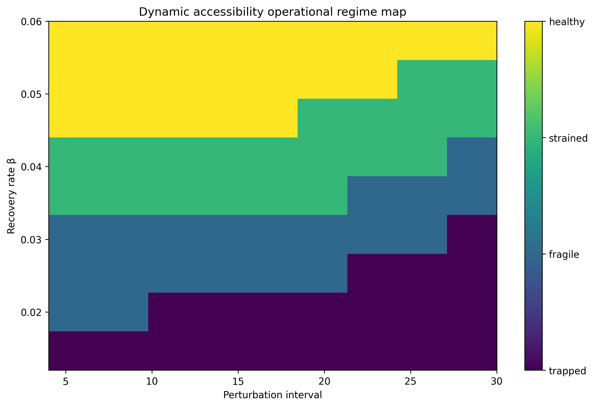

# ERC-Dynamic-Accessibility-Lattice

[](https://doi.org/10.5281/zenodo.20401824)


**Exploratory computational notebook on dynamic accessibility under perturbation–recovery constraints.**

This repository explores whether systems may preserve structural scaffold while progressively reorganizing which futures remain operationally accessible under perturbation–recovery constraints.

The framework uses a minimal lattice-based computational abstraction with fixed structural connectivity and dynamically changing traversability to test whether accessibility organization may emerge without requiring explicit structural disconnection.

---

## Operational question

> **May accessibility organization emerge operationally under perturbation–recovery constraints while scaffold remains preserved?**

Rather than assuming accessibility loss necessarily requires structural removal, the notebook evaluates whether perturbation timing, recovery kinetics, perturbation history, and stochasticity may progressively reorganize operational accessibility while scaffold structure remains fixed.

---

## Main result (operational summary)

<p align="center">
  
</p>

**Dynamic accessibility operational regime map**

The explored perturbation–recovery parameter space appears to organize into interpretable operational regions characterized by changing accessibility efficiency, coordination burden, and reachable futures despite preserved scaffold structure.

Importantly, these regions are **heuristic operational summaries rather than hard physical boundaries**.

---

## Key observables

The notebook evaluates accessibility through operational quantities including:

- reachable future fraction,
- accessibility cost,
- weighted accessibility efficiency,
- timing-dependent accessibility,
- recovery kinetics,
- perturbation-history effects,
- robustness and falsification-oriented controls.

---

## Repository structure

```text
.
├── notebooks/     # executable notebook(s)
├── papers/        # manuscript / computational note
├── figures/       # generated figures
├── data/          # exported CSV datasets
├── LICENSE
└── README.md
```

---

## Reproducibility

The repository accompanies a fully executable computational notebook and exported intermediate observables.

Materials include:

- executable notebook,
- generated figures,
- exported datasets,
- perturbation–recovery parameter sweeps,
- robustness and falsification-oriented controls.

The notebook should be considered the **primary computational object**, while the accompanying manuscript serves as an interpretive and methodological companion.

---

## Interpretation and limitations

This repository should be interpreted as an **exploratory computational abstraction**, not a fitted biological, physical, or mechanistic model.

No claim is made regarding universal laws, causal mechanisms, or domain-specific predictive behavior.

Instead, the framework asks a narrower falsification-oriented question:

> **Can operational accessibility reorganize while structural scaffold remains preserved?**

---

## Citation


If using or referencing this repository, please cite the Zenodo release:

Ojeda, J. (2026). *ERC Dynamic Accessibility Lattice* (Version 1.0.0). Zenodo.

DOI: https://doi.org/10.5281/zenodo.20401824

---

## License

This repository is licensed under the **Creative Commons Attribution 4.0 International License (CC BY 4.0)**.

See [LICENSE](LICENSE).
